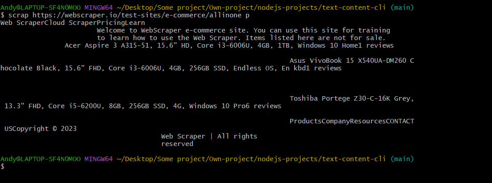

# web-scraping-cli-app

> CLI tool to perform personalized web scrapping

# Get started

Clone the repository and install all the packages

    git clone https://github.com/HandyyWeb/web-scraping-cli-app.git
    npm install

Install globally

    npm install -g

# Documentation

To see how it works, run `scrap --help`

    scrap --help
    Usage: scrap <document url> <css selector>

    Options:
        --version  Show version number                                       [boolean]
        --help     Show help                                                 [boolean]

Basic usage

    scrap <document url><css selector>

Exemple

    scrap https://webscraper.io/test-sites/e-commerce/allinone p

    Welcome to WebScraper e-commerce site. You can use this site for training
                        to learn how to use the Web Scraper. Items listed here are not for sale.
                12.5", Core i5 2.6GHz, 8GB, 180GB SSD, Win7 Pro 64bit10 reviews

                                                                        Asus ROG Strix GL702ZC-GC209T, 17.3" FHD IPS, Ryzen 7 1700, 16GB, 256GB SSD + 1TB HDD, Radeon RX 580 4GB, Windows 10 Home8 reviews

                                                                        Asus ROG Strix GL753VE-GC096T, 17.3" FHD, Core i7-7700HQ, 8GB, 1TB + 128GB SSD, GeForce GTX 1050 Ti 4GB, Windows 10 Home, Eng kbd7 reviews

                                                                        ProductsCompanyResourcesCONTACT USCopyright © 2023
                                        Web Scraper | All rights
                                        reserved

# Author & Contacts

Lebreton Andy

E-mail : lebreton.andy@proton.me
